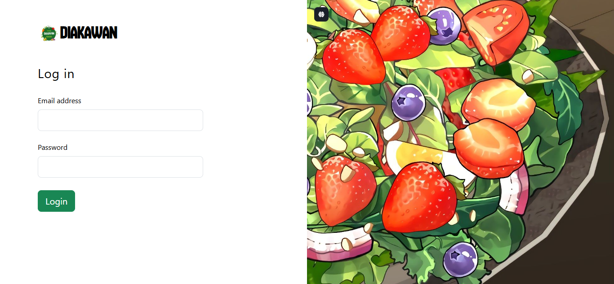
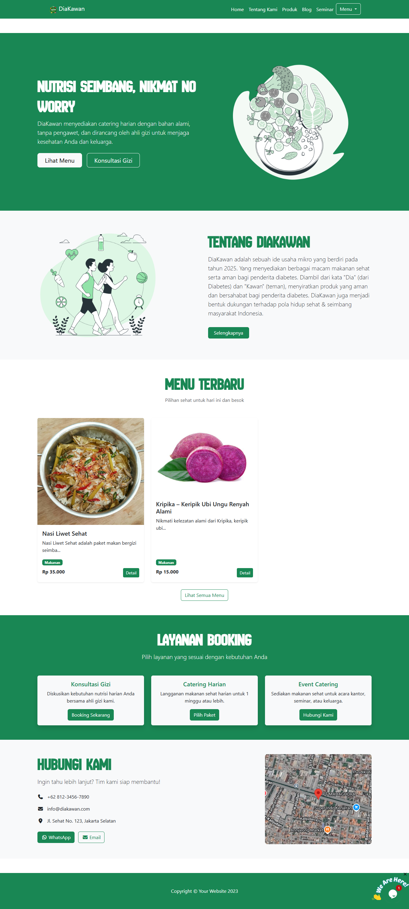
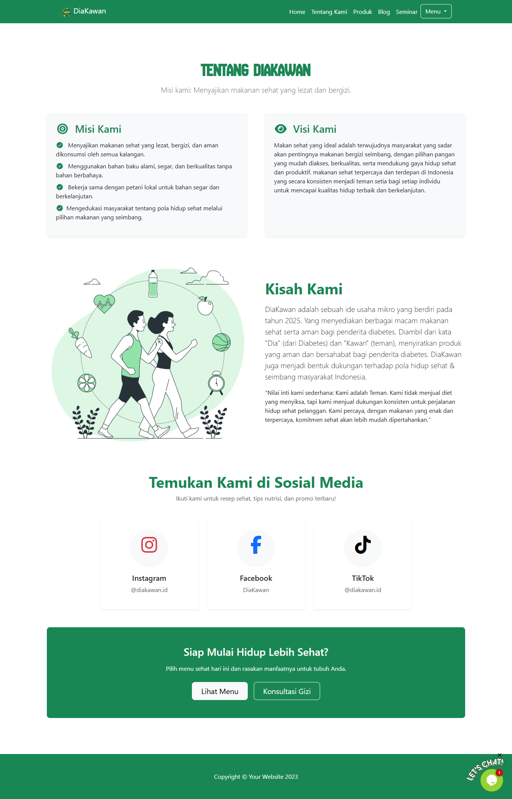
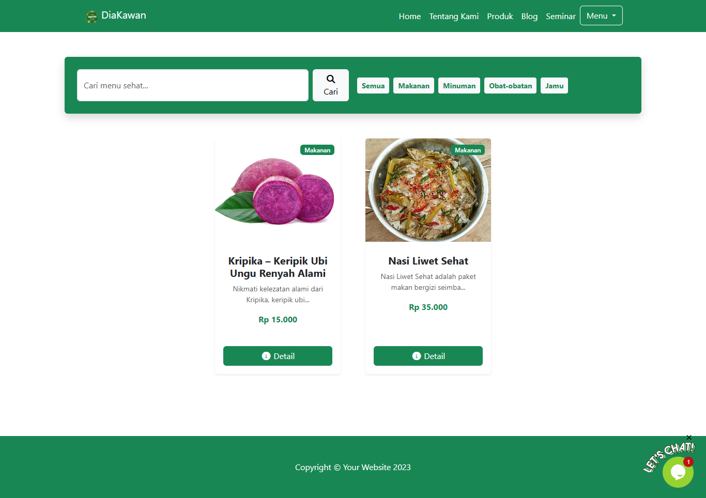
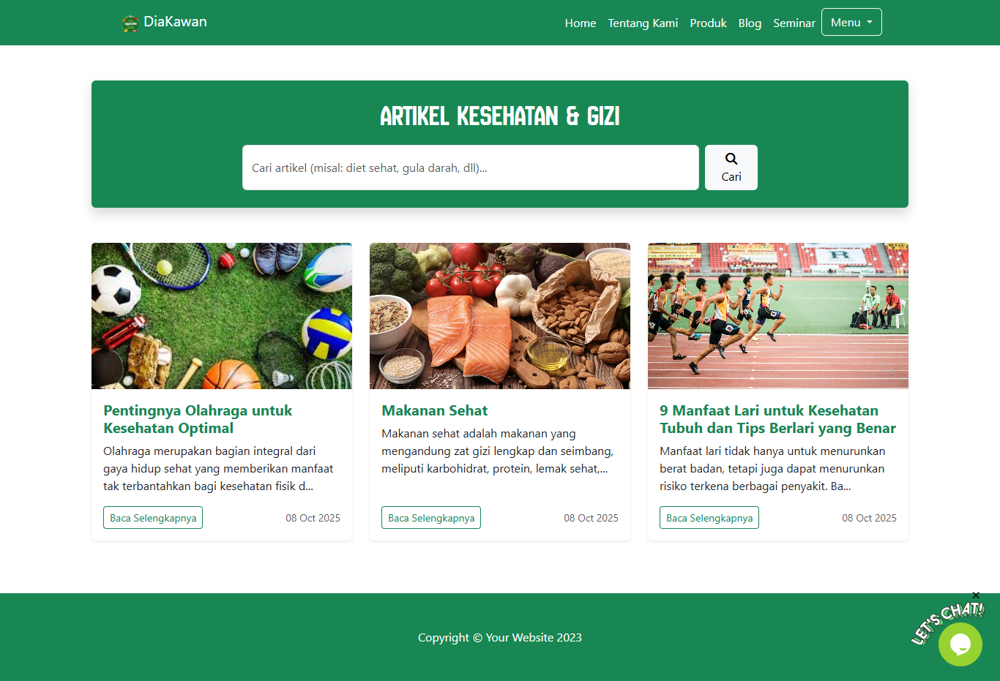

# DiaKawan

DiaKawan is a platform that supports the marketing of products produced by DiaKawan in the form of healthy foods.

# Tech Stack DiaKawan

**PHP:** Programming language for server-side logic.

**Laravel:** PHP framework for web application development.

**Bootstrap:** CSS framework to enhance the appearance of DiaKawan.

**SB Admin:** This is the template required by DiaKawan employees to manage orders. .

**Visual Studio Code:** Text editor used for development.

**MySql:** Database used for local development and testing.

# Screenshots

## Login Page

## Home Page

## About Page

## Product Page

## Blog Page

